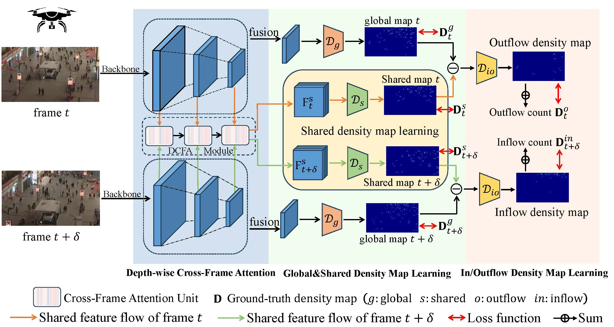
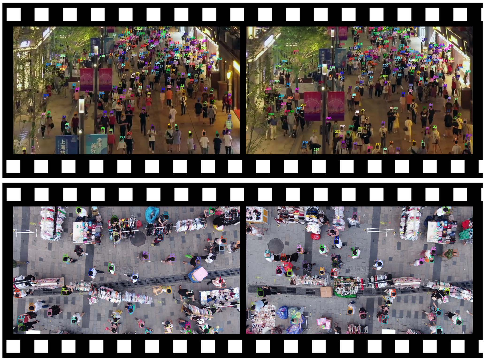

# Video Individual Counting for Moving Drones (ICCV 2025 Highlight)
## Introduction
This is the official PyTorch implementation of paper: [Video Individual Counting for Moving Drones](https://arxiv.org/abs/2503.10701), which introduce a video-level individual counting dataset captured by fast-moving drones in various crowded scenes and propose a **S**hared **D**ensity map-guided  **Net**work (**SDNet**) for VIC.
that bypasses the challenging localization step and instead adopts a more learnable manner by first learning shared pedestrian density maps between consecutive frames.



# Catalog
✅ MovingDroneCrowd

✅ Training and Testing Code for SDNet

✅ Pretrained models for MovingDroneCrowd

# MovingDroneCrowd
To promote practical crowd counting, we introduce MovingDroneCrowd — a video-level dataset specifically designed for dense pedestrian scenes captured by moving drones under complex conditions. **Notably, our dataset provides precise bounding box and ID labels for each person across frames, making it suitable for multiple pedestrian tracking from drone perspective in complex scenarios.**



The folder organization of MovingDroneCrowd is illustrated below:
```bibtex
$MovingDroneCrowd/
├── frames
│   ├── scene_1
│   │   ├── 1
│   │   │   ├── 1.jpg 
│   │   │   ├── 2.jpg
│   │   │   ├── ...
│   │   │   └── n.jpg
│   │   ├── 2
│   │   ├── ...
│   │   └── m
│   ├── scene_2
│   ├── ...
│   └── scene_k
├── annotations
│   ├── scene_1
│   │   ├── 1.csv
│   │   ├── 2.csv
│   │   ├── ...
│   │   └── m.csv
│   ├── scene_2
│   ├── ...
│   └── scene_k
├── scene_label.txt
├── train.txt
├── test.txt
└── val.txt
```
Each scene folder contains several clips captured within that scene, and each clip has a corresponding CSV annotation file.
MovingDroneCrowd are available at the [Google Drive](https://drive.google.com/file/d/1RUGncEVEi3cUtqEWJLFejt8CF8BNbuxv/view?usp=drive_link).

# Getting started

## preparatoin
* Clone this repo in the directory 

* Install dependencies. We use python 3.11 and pytorch == 2.4.1 : http://pytorch.org.

    ```bibtex
    conda create -n SDNet python=3.11
    conda activate SDNet
    conda install pytorch==2.4.1 torchvision==0.19.1 torchaudio==2.4.1 pytorch-cuda=12.4 -c pytorch -c nvidia
    cd ${SDNet}
    pip install -r requirements.txt
    ```
* Datasets

    ◦ **MovingDroneCrowd**: Download MovingDroneCrowd dataset from this [link](https://drive.google.com/file/d/1VufYjfFBFA96UCHK6XJYhgQBkRKokQte/view?usp=drive_link). Unzip `MovingDroneCrowd.zip` and place `MovingDroneCrowd` into your datasets folder.

    ◦ **UAVVIC**: Please refer to their code repository [CGNet](https://github.com/streamer-AP/CGNet).

## Training

Check some parameters in `config.py` before training:

* Use `__C.DATASET = 'MovingDroneCrowd'` to set the dataset (default: `MovingDroneCrowd`).
* Use `__C.NAME = training_name` to set the name of the training, which will be a part of the save directory.
* Use `__C.PRE_TRAIN_COUNTER` to set the pre-trained counter to accelerate the training process.
* Use `__C.GPU_ID = '0'` to set the GPU. You can set `__C.GPU_ID = '0, 1, 2, 3'` if you have multiple GUPs.
* Use `__C.MAX_EPOCH = 100` to set the number of the training epochs (default:100). The pre-trained counter can be download from this [link]().
* Set dataset related parameters (`DATA_PATH`, `TRAIN_BATCH_SIZE`, `TRAIN_SIZE` etc.) in the `SDNet/datasets/setting`.
* run `python train.py` for one GPU, or run `torchrun --master_port 29515 --nproc_per_node=4 train.py`for multiple GPUs. (for example, 4 GPUs)

Tips: The training process takes ~12 hours on `MovingDroneCrowd` dataset with two A800 (80GB Memory).

## Test

To reproduce the performance, download the pre-trained models from [Google Drive]() and then place pretrained_model files to `SDNet/pre_train_model/`. Check some parameters in `test.py` before test:

* Use `DATASET = MovingDroneCrowd` to set the dataset used for test.
* Use `test_name = xxx` to set a test name, which will be a part of the save director of test reults.
* Use `test_intervals = 4` to set frame interval for test (default `4` for `MovingDroneCrowd`). 
* Use `model_path = xxx` to set the pre-trained model file.
* Use `GPU_ID = 0` to set the GPU used for test.
* run `test.py`

# Citation
If you find this project is useful for your research, please cite:

```bibtex
@article{MVC,
  title={Video Individual Counting for Moving Drones},
  author={Fan, Yaowu and Wan, Jia and Han, Tao and Chan, Antoni B and Ma, Andy J},
  booktitle={ICCV},
  year={2025}
}
 ```

# Acknowledgement

The released PyTorch training script borrows some codes from the [DRNet](https://github.com/taohan10200/DRNet). If you think this repo is helpful for your research, please consider cite them.