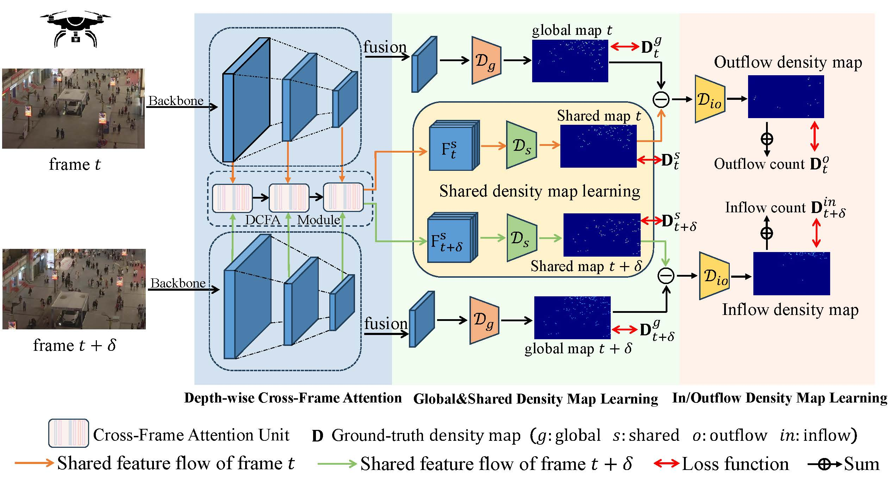
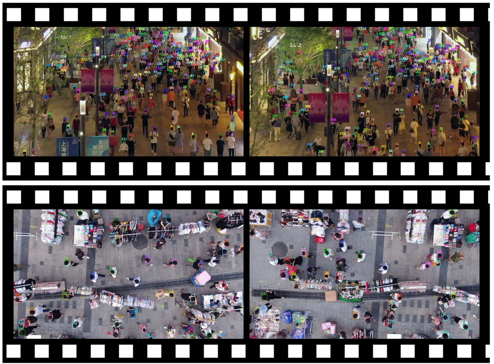

# Video Individual Counting for Moving Drones (ICCV 2025 Highlight)
## Introduction

> **🚀 Extension Update:**
> We have extended this work to **[Video Individual Counting and Tracking from Moving Drones: A Benchmark and Methods](http://arxiv.org/abs/2601.12500)**. This new version introduces the **MovingDroneCrowd++** dataset and a stronger, more interpretable density-map-based VIC algorithm that enables tracking via simple post-processing, achieving significant performance improvements on both VIC and MOT tasks compared to previous methods. 
> *The new dataset, code, and pre-trained models corresponding to the extended paper will be updated here soon.*

This is the official PyTorch implementation of paper: [Video Individual Counting for Moving Drones](https://arxiv.org/abs/2503.10701), which introduce a video-level individual counting dataset captured by fast-moving drones in various crowded scenes and propose a **S**hared **D**ensity map-guided  **Net**work (**SDNet**) for VIC that bypasses the challenging localization step and instead adopts a more learnable manner by first learning shared pedestrian density maps between consecutive frames.



# Roadmap 
This project is under active development. We are currently extending the framework with:
* Extend the current dataset to a larger and more diverse one.

* Propose a faster, more interpretable, and better-performing method. 

# Catalog
✅ MovingDroneCrowd

✅ Training and Testing Code for SDNet

# MovingDroneCrowd
To promote practical crowd counting, we introduce MovingDroneCrowd — a video-level dataset specifically designed for dense pedestrian scenes captured by moving drones under complex conditions. **Notably, our dataset provides precise bounding box and ID labels for each person across frames, making it suitable for multiple pedestrian tracking from drone perspective in complex scenarios.**



The folder organization of MovingDroneCrowd is illustrated below:
```
$MovingDroneCrowd/
├── frames
│   ├── scene_1
│   │   ├── 1
│   │   │   ├── 1.jpg 
│   │   │   ├── 2.jpg
│   │   │   ├── ...
│   │   │   └── n.jpg
│   │   ├── 2
│   │   ├── ...
│   │   └── m
│   ├── scene_2
│   ├── ...
│   └── scene_k
├── annotations
│   ├── scene_1
│   │   ├── 1.csv
│   │   ├── 2.csv
│   │   ├── ...
│   │   └── m.csv
│   ├── scene_2
│   ├── ...
│   └── scene_k
├── scene_label.txt
├── train.txt
├── test.txt
└── val.txt
```
Each scene folder contains several clips captured within that scene, and each clip has a corresponding CSV annotation file. Each annotation file consists of several rows, with each row in the following format:
`0,0,1380,2137,27,23,-1,-1,-1,-1`.

The first column indicates the frame index, the second column represents the pedestrian ID, and the third to sixth columns specify the bounding box of the pedestrian's head — including the top-left corner coordinates (x, y), width (w), and height (h). Note that image files are named starting from 1.jpg, while both frame indices and pedestrian IDs start from 0. The last four -1 values are meaningless. MovingDroneCrowd are available at the [Google Drive](https://drive.google.com/file/d/1HW82KG8savX8ixMCzqKYRena-qTFMuIt/view?usp=drive_link) or [Baidu Netdisk](https://pan.baidu.com/s/13NsJehHNw5IfGZy7qE2R6w?pwd=1234).

# Getting started

## preparatoin
* Clone this repo in the directory 

* Install dependencies. We use python 3.11 and pytorch == 2.4.1 : http://pytorch.org.

    ```
    conda create -n MovingDroneCrowd python=3.11
    conda activate MovingDroneCrowd
    conda install pytorch==2.4.1 torchvision==0.19.1 torchaudio==2.4.1 pytorch-cuda=12.4 -c pytorch -c nvidia
    cd ${MovingDroneCrowd}
    pip install -r requirements.txt
    ```
* Datasets

    ◦ **MovingDroneCrowd**: Download MovingDroneCrowd dataset. Unzip `MovingDroneCrowd.zip` and place `MovingDroneCrowd` into your datasets folder.

    ◦ **UAVVIC**: Please refer to their code repository [CGNet](https://github.com/streamer-AP/CGNet).

## Training

Check some parameters in `config.py` before training:

* Use `__C.DATASET = 'MovingDroneCrowd'` to set the dataset (default: `MovingDroneCrowd`).
* Use `__C.NAME = xxx` to set the name of the training, which will be a part of the save directory.
* Use `__C.PRE_TRAIN_COUNTER` to set the pre-trained counter to accelerate the training process. The pre-trained counter can be download from [Google Drive](https://drive.google.com/file/d/1VME0IXJav-nXK9mu9-FrQEngfXmvgVCs/view?usp=drive_link) or [Baidu Netdisk](https://pan.baidu.com/s/1sfA2-tG40WtKHePgXqWhMw?pwd=1234).
* Use `__C.GPU_ID = '0'` to set the GPU. You can set `__C.GPU_ID = '0, 1, 2, 3'` if you have multiple GUPs.
* Use `__C.MAX_EPOCH = 100` to set the number of the training epochs (default:100). 
* Set dataset related parameters (`DATA_PATH`, `TRAIN_BATCH_SIZE`, `TRAIN_SIZE` etc.) in the `datasets/setting`.
* run `python train.py` for one GPU, or run `torchrun --master_port 29515 --nproc_per_node=4 train.py`for multiple GPUs. (for example, 4 GPUs)

Tips: The results in the paper were obtained using two A800 GPUs (80G), with a batch size of 2 per GPU (total batch size = 4), and training took approximately 12 hours on `MovingDroneCrowd`. The number of training epochs can be set to 120.  

## Test

<!--To reproduce the performance, download the pre-trained models from [Google Drive]() and then place pretrained_model files to `SDNet/pre_train_model/`. -->
Check some parameters in `test.py` before test:

* Use `DATASET = MovingDroneCrowd` to set the dataset used for test.
* Use `test_name = xxx` to set a test name, which will be a part of the save director of test reults.
* Use `test_intervals = 4` to set frame interval for test (default `4` for `MovingDroneCrowd`). 
* Use `model_path = xxx` to set the pre-trained model file.
* Use `GPU_ID = 0` to set the GPU used for test.
* run `test.py`

# Citation
If you find this project is useful for your research, please cite:

```bibtex
@article{MDC,
  title={Video Individual Counting for Moving Drones},
  author={Fan, Yaowu and Wan, Jia and Han, Tao and Chan, Antoni B and Ma, Andy J},
  booktitle={ICCV},
  year={2025}
}
 ```

# Acknowledgement

The released PyTorch training script borrows some codes from the [DRNet](https://github.com/taohan10200/DRNet). If you think this repo is helpful for your research, please consider cite them.